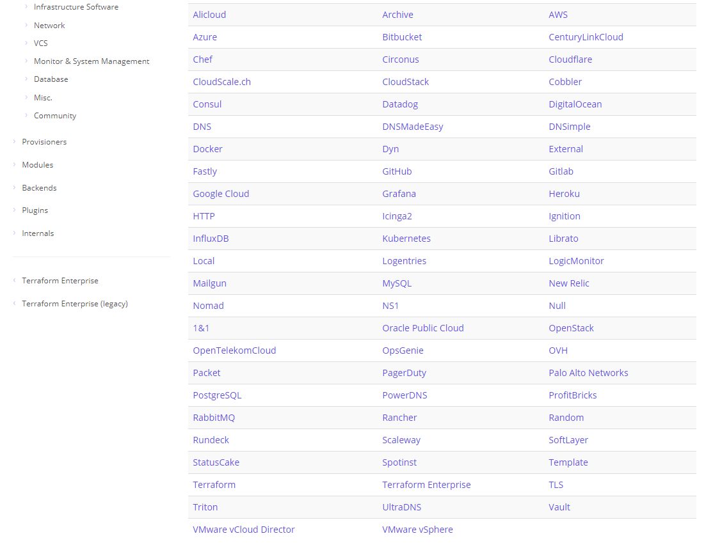

## TerraformでInfrastructure as Codeっぽいことをやってみる
### @インフラ勉強会

---

### 軽く自己紹介

- chataro0
- サーバメインのインフラエンジニア
    - 昔は監視ばっかやってた
    - ネットワークはちょろちょろ
    - クラウドを広く浅く使ってる
        - pythonでAPIを叩いたり
        - IaaS中心なのでSaaSとかFaaSとかもっと活用したい
        - AWS歴は3,4年ぐらい（空白期間あり）
        - Terraform歴・・・1,2ヶ月ぐらい？（仕事では使ってない）

---

## お品書き
- Terraformって何？
-  AWSにTerraformを使ってみる  
    1. まずは準備
    2. シンプルなEC2インスタンスを作ってみる
    3. Terraformコマンド
    4. 変数部分を分けて書く, ほしい情報を出力させる
    5. AMI IDとか書きたくない！
    6. 自作AMIでterraform
    7. moduleを使ってみる
- まとめ的なもの
---

## Terraformって何？

+++

## [Terraform](https://www.terraform.io/)


- Write, Plan, and Create Infrastructure as Code
- Powered by [HashiCorp](https://www.hashicorp.com/)
    - [Vagrant](https://www.vagrantup.com/)
    - [Packer](https://packer.io/)
    - and more...

+++

## クラウドのデプロイメントに強い(らしい)ツール

+++


[Providers](https://www.terraform.io/docs/providers/index.html)


+++

### 思ってた以上に色々できるみたいだけど、  
### 各種クラウドへのデプロイメントが強いってことで...

+++

### Terraform or CloudFormation ?

(https://www.terraform.io/intro/vs/cloudformation.html)

やっぱりAWS, OpenStackだけではなく  
クラウドには依存せず、複数のプロバイダとサービスを組み合わせて構成できる！  
というのが強みらしい


+++

### じゃあどうやって使うの？
### 機能面の違いは？

+++

### 実際使ってみるのが一番わかりやすいと思うので、  
### 早速AWSにデプロイしてみよう！

---

### AWSにTerraformを使ってみる

---

### 1. まずは準備

- AWS側
    - IAM
- 端末側
    - terraformのダウンロード
    - （AWSクレデンシャルの設定）


AWSアカウントは持ってるものとします

+++

## AWS側

### IAM

- 必要な権限に合わせて付与
- 今回はこれぐらいあれば良いかと（必要最低限とかではない）
    - AmazonEC2FullAccess
    - (AmazonS3FullAccess)

Credentialsは後で使います

+++

## 端末側

- ダウンロード
    - マルチプラットフォーム対応
        - 自前の環境のOSに合わせて [ダウンロード](https://www.terraform.io/downloads.html)
        - とはいえLinux, Macがオススメ
    - 展開されたバイナリ単独で動く
        - その他のモジュールとの依存関係なし
        - PATHを通すだけで使える

Terraform自体はこれだけ！（これだけとは言っていない）

+++

## 端末側

### AWSクレデンシャルの設定

他の方法もあるので必須じゃないけど  
環境変数に入れてしまうのが一番楽かと。（詳細は後述）  
`~/.bashrc`
に入れるかはお任せします

```bash
export AWS_ACCESS_KEY_ID="AWS_ACCESS_KEY_ID"
export AWS_SECRET_ACCESS_KEY="AWS_SECRET_ACCESS_KEY"
export AWS_DEFAULT_REGION=ap-northeast-1
```

+++

## 端末側

スライド含めコンフィグを以下のGitに置いてます

```bash
cd {workspase} # 適当なディレクトリで
git clone git@github.com:chataro0/terra_workshop.git
cd terra_workshop
```

---

### 2. シンプルなEC2インスタンスを作ってみる

Hello World的なもの

```bash
cd step01
```

```bash
$ ls 
main.tf  main.tf.org
```


+++

Terraformの設定ファイルは "_*.tf_" or "_*.tf.json_"  
ディレクトリ内の複数ファイルを読み込む [doc](https://www.terraform.io/docs/configuration/load.html)

例: `main.tf`

```javascript
provider "aws" {
    region = "ap-northeast-01"
}

resource "aws_instance" "ec2" {
    ami  = "ami-c2680fa4"      # Amazon Linux 2 LTS Candidate AMI
    instance_type = "t2.micro"
}
```
- それぞれの設定の解説は後ほど
- (なんかjavascriptのシンタックスだといい感じに)

+++

- `provider` 設定 
    - プロバイダの設定をする [doc](https://www.terraform.io/docs/configuration/providers.html)
    - `aws`
        - 設定方法は何種類かある
            - 環境変数で指定（AWS_ACCESS_KEY_ID, AWS_SECRET_ACCESS_KEY, AWS_DEFAULT_REGION）
                - すべて設定済なら、provider設定なしでも問題なし
            - access_key, secret_key, region のパラメータを指定
            - AWS-CLIのprofile
            - IAM Role

+++

- `resource` 設定
    - 作成するリソース情報を指定する [doc](https://www.terraform.io/docs/configuration/resources.html)
    - resource `TYPE` `NAME` {`parameters` = `values`}
    - `TYPE` : プロバイダ毎に用意されているリソースタイプを指定（例：[AWSのresource](https://www.terraform.io/docs/providers/aws/index.html)）
    - `NAME` : 同一`TYPE`でユニークな名前を指定
    - `parameters`, `values`: 
        - リソースタイプ毎にRequired/Optionalのパラメータがあるので適宜指定
        - どのリソースでも使える[Meta-parameters](https://www.terraform.io/docs/configuration/resources.html#meta-parameters)も
            - countとか

---

## 3. Terraform コマンド

+++

### `init`

```bash
$ terraform init [OPTIONS] [DIR]

Initializing provider plugins...
~ 中略 ~
* provider.aws: version = "~> 1.9"

Terraform has been successfully initialized!
```

- 作業ディレクトリの初期構成
    - 別に設定ファイルが消えるわけじゃない
    - プラグインのインストールしたり
    - モジュール（後述）をコピーしてきたり

+++

### `plan`

```bash
$ terraform plan [OPTIONS] [DIR]
Refreshing Terraform state in-memory prior to plan...
~ 中略 ~
  + aws_instance.ec2
      id:                           <computed>
      ami:                          "ami-c2680fa4"
      associate_public_ip_address:  <computed>
~ 中略 ~
Plan: 1 to add, 0 to change, 0 to destroy.
```

- Terraformの実行計画を生成
    - いわゆるdry-run
    - `<computed>`は実際作成する際に生成されるのでplan時は未定

+++

### `apply` (1)

```bash
$ terraform apply [OPTIONS] [DIR]
~ 中略 (planと大体一緒)~
Do you want to perform these actions?
  Terraform will perform the actions described above.
  Only 'yes' will be accepted to approve.

  Enter a value: 
```

- Terraformを実行してデプロイ
    - `plan`のような出力が出て確認が求められるので、yesで実行
    - `--auto-approve`で省略できる

+++

### `apply` (2)
```bash
  Enter a value: yes
  ~ 中略 (planと大体一緒)~
aws_instance.ec2: Still creating... (10s elapsed)
aws_instance.ec2: Still creating... (20s elapsed)
aws_instance.ec2: Still creating... (30s elapsed)
aws_instance.ec2: Creation complete after 35s (ID: i-hogehoge)

Apply complete! Resources: 1 added, 0 changed, 0 destroyed.
```
+++

### `apply` (3)

```bash
$ vi main.tf
~~~~~
$ terraform apply [OPTIONS] [DIR]
```

- コンフィグ変更後のアップデートもapplyを使用
- 出力にはどのような変更が発生するかが表示される

+++

### `show`

```bash
$ terraform show [OPTIONS] [DIR]
aws_instance.ec2:
  id = i-hogehoge
  ami = ami-foobar
  associate_public_ip_address = true
  ~略~
```

- 実際作成されたリソースの情報を表示

+++

### terraform.tfstate

```
$ cat terraform.tfstate
{
    "version": 3,
    "terraform_version": "0.11.3",
    "serial": 2,
    "lineage": "hogehoge",
    "modules": [
        {
            "path": [
                "root"
            ],
            "outputs": {},
            "resources": {
                "aws_instance.ec2": {
                    ~中略~
                }
            }
        }
    ]
}

```

- 作成したリソース情報がjson形式で保存される
- ステートとして利用されるので直接編集は厳禁

+++

### `destroy`

```bash
$ terraform destroy [options] [DIR]
aws_instance.ec2: Refreshing state... (ID: i-hogehoge)

An execution plan has been generated and is shown below.
Resource actions are indicated with the following symbols:
  - destroy

Terraform will perform the following actions:

  - aws_instance.ec2


Plan: 0 to add, 0 to change, 1 to destroy.

Do you really want to destroy?
  Terraform will destroy all your managed infrastructure, as shown above.
  There is no undo. Only 'yes' will be accepted to confirm.

  Enter a value: 
```

- terraformで作成したリソースを削除する
- 削除の実行計画は`terraform plan -destroy`で確認可能
- -forceで確認省略

+++

### terraform.tfstate
### terraform.tfstate.backup

- terraform.tfstate
    - apply, destroy等で変更する度に最新のリソース状態が反映される
- terraform.tfstate.backup
    - １世代前のリソース状態を保持

---

## 4. 変数部分を分けて書く, ほしい情報を出力させる

+++

### variable

変数部分は切り出して書きたい場合

```bash
$ cd ../step02
$ cat main.tf
variable "sg_name" {}
variable "ami_id" {}
variable "instance_type" {}

resource "aws_security_group" "sg" {
    name = "${var.sg_name}"
}

resource "aws_instance" "ec2" {
    ami  = "${var.ami_id}"
    instance_type = "${var.instance_type}"
    vpc_security_group_ids = ["${aws_security_group.sg.id}"]
}
```

+++

- `variable` 設定
    - 変数の定義をする（変数に入れる値を指定するのは別の場所） [doc](https://www.terraform.io/docs/configuration/variables.html)
    - オプションとしてtype(変数の型), default, descriptionを指定できる
    - 値を使うには`"${var.ami_id}"`のように指定

+++

- apply時などの値の指定方法
    - ファイル
        - ファイル名が __terraform.tfvars__ or __*.auto.tfvars__ なら自動でロード
        - `-var-file=ファイル名` で明示的に指定
    - オプション
        -  `-var foo=bar` のように指定
    - 環境変数
        - `TF_VAR_foo=bar` のような環境変数があると自動で読み込む
    - モジュールでの指定方法は後述

+++

### output

```bash
$ cat outputs.tf 
output "instance_id" {
      value = "${aws_instance.ec2.id}"
}
output "public_ip" {
      value = "${aws_instance.ec2.public_ip}"
}
```

+++

- output 設定
    - apply時に生成された任意のパラメータを出力する
        -  `terraform show`などを実行しなくても済む
    -  "`${リソースタイプ.リソース名.パラメータ名}"`で指定
    -  applyコマンドの出力としてだけでなく、
    -  `terraform output [アウトプット名]`でいつでも取得可能
        -  sshなどその他のコマンドと連携するのに使いやすい

---

## ここまでのまとめ

- Terraformは結構便利
    - 作った一連のリソースをまとめて削除したり
    - ちょっとした変更したときにアップデートしたり
- ただ、AMIのIDのようにリージョンによって変わったり、
- アップデートでIDが変わるものをコピペするのはめんどい
- 静的なファイルではこのあたりが限界かな…？

+++

# ちょっと待った！！

+++

**Infrastructure as Code** なツールなんだから、  
定義を書けばちゃんと好きな値は取ってこれる！

- 自分の調査不足、理解不足でした orz

---
## 5. AMI IDとか書きたくない！

+++

### data source

```bash
$ cd ../step03
$ cat main.tf
data "aws_ami" "amazon2_linux" {
    most_recent = true
    owners = ["amazon"]
    filter {
        name = "name"
        values = ["amzn2-ami-hvm-*"]
    }
}
```
+++

- data source 設定
    - Terraformの外部(provider側など)で定義された情報を取ってこれる [doc](https://www.terraform.io/docs/configuration/data-sources.html)
    - data TYPE NAME {parameters = values}
    - resource同様、プロバイダ毎に取得可能なdataが用意されている
    - ID, 名前で完全一致させたり、フィルタリングして該当するリソース情報を探せる
    - 結果的に１つに絞り込めなかった場合は、applyなどは失敗する
    - 値を呼び出すときは ` "${data.aws_ami.amazon2_linux.id}"`のように指定
    - CloudFormationでは[Lambda-Backed Custom Resources](https://dev.classmethod.jp/cloud/aws/get-latest-ami-by-using-lambda-backed-custom-resources/)を使わないといけないっぽい
        - terraformのほうがスマートかも？

+++
```js
data "aws_ami" "amazon2_linux" {
    most_recent = true
    owners = ["amazon"]
    filter {
        name = "name"
        values = ["amzn2-ami-hvm-*"]
    }
}
```
- data "aws_ami"
    - owners: amazon, self, あるいはアカウントIDをリスト型で指定
    - filter: nameとvalues(リスト型)で指定。\*であいまい検索も可能
    - most_recent: フィルタリングの結果の中で最新のものを使う
---

## 6. 自作AMIでterraform

+++

- 条件に合う最新のAMIが取ってこれる
- なら、いわゆるゴールデンイメージ形式できるんじゃない？！
    - packer, ansibleでゴールデンイメージ作成
    - terraformのdata設定からそのAMI IDが取得できればイケる！
        - イメージの管理方法はそれぞれだけど、タグから検索できれば言うことなし

+++
```bash
$ cd ../step04
$ cat main.tf
```

```js
data "aws_ami" "amazon2_linux" {
    most_recent = true
    owners = ["self"]
    filter {
        name = "tag:service"
        values = ["web"]
    }
}
```
self=自分が作った、serviceタグの値がwebのうち、最新のAMIを使う

+++

```bash
cd packer
packer build packer01.json
```

- packerでビルドしてる
    - source_ami_filterという、先ほどのdata aws_amiのような仕組みでamzn-ami-\*で最新のイメージを利用
    - 11行目の以下の記述は、自分の秘密鍵のファイルパスに合わせてください
        ```bash
        "ssh_private_key_file": "/home/vagrant/.ssh/homekey.pem"```
    - serviceタグにwebという値をセット
    - プロビジョナとしてansibleも使ってみたり
    - にわか仕込みなので解説はしません！
        - どなたかお願いします！

---
## 7. moduleを使ってみる

+++

```bash
cd ../step05
cat modules.tf
```

+++

- module
    - sourceで今まで使ってきたterraformファイル群の読み込みと、variableに与えたい値を指定できる
    - sourceはローカルのディレクトリパスの他に
        - [Terraform Module Registry](https://registry.terraform.io/)
        - github上にあるもの　[（例）](https://github.com/terraform-community-modules/tf_aws_ec2_instance)
    - 誰かが作ったものを再利用できる！asCodeっぽい！

+++

```bash
terraform get
```
- module sourceを読み込む
    - .terraform/以下に格納される
- でも`terraform init`に内包されているので実は叩く必要はないっぽい

---

## まとめ的なもの

+++

## 使い心地はどうでしたか？
### 特にCloudFormation利用者に聞いてみたいです

+++

### 個人的な感想

- Terraform & CloudFormation 共通
    - Infrastructure as Codeなメリットがある
    - 一気に作ったり、まとめて消したりが簡単
        - ゴミが残らない

+++

- メリット
    - なんとなくCFNより使いやすい（小並感）
        - ドキュメントがわかりやすい
        - 変更時の差分が見やすい
        - 再利用しやすいのもいい！
    - PackerやAnsibleなどのasCodeなOSSとも連携させやすい
    - 他のクラウドも使ってみようかな？という気にさせてくれる

+++

- デメリット
    - プロバイダ側標準には説得力とか対応の早さは一歩劣る
    - 一人で使うならいいけど、複数人だと重複とか心配？
        - tfstateファイルがローカルなのはリスキー

+++

### 複数人で管理したい場合

- [backend機能](https://www.terraform.io/docs/backends/types/local.html)
    - S3などにtfstateファイルを置ける
    - JenkinsなどのCIツールで実行すると尚良し？
    - ConsulやTerraform Enterpriseで管理できるらしい
       - 使ってる方、自分たちなりの方法があったら聞きたいです！

+++

## 求ム！Terraformers！！！
